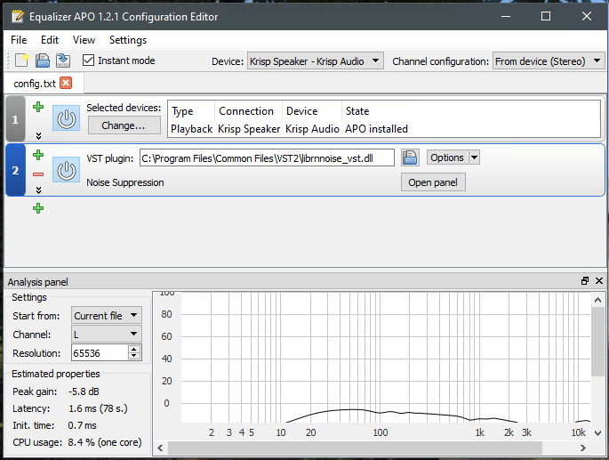

# Discord: Denoise Your Friends
Instructions for how to denoise your friend's microphones on [Discord](https://discord.com).

## Motivation
On Windows, Discord provides noise suppression via Krisp.ai to denoise your microphone.

*Awesome!*

... but what if I need to denoise my friends' microphones?

This can happen for various reasons. E.g.
* Your friends refuse to turn on noise suppression.
* Your friends are on a platform where Krisp.ai is not available.
* You've finally reached your limit.

It'd be awesome if we could do this easily from within discord itself,
but we can't (yet?).

## Ok, so what's the plan?

Insert [Xiph.org's RNNoise Suppressor](https://github.com/xiph/rnnoise)
into our audio pipeline, but only for voice applications. This algorithm
has already been conveniently packaged as an audio plugin for Windows
and Linux by [Werman](https://github.com/werman) over at
https://github.com/werman/noise-suppression-for-voice


## Some Questions...

**Q:** But what if I just want to denoise my own my own microphone, but I'm on Linux?

- **A:** Follow the instructions for Pulse Audio / LADSPA here:

    https://github.com/werman/noise-suppression-for-voice

**Q:** Will this affect my music/movies/games/etc?

- **A:** No. It only affects applications that you explicitly route
  to the noise suppressor.

**Q:** Can I use this AND denoise my mic also?

- **A:** Yes.

## Status

These instructions should be considered beta. They are mostly my notes
from having done this before, but could use further testing.

## Instructions for Ubuntu Linux

**Overview:** We need to create a virtual audio sink to send the Discord
output to, then run the above listed noise suppression on it.

1. Install prerequisites

    ```sh
    $ sudo apt-get update
    $ sudo apt-get install -y git build-essential cmake
    ```

2. Download and compile the `noise-suppression-for-voice` plugin like so:

    ```sh
    $ git clone https://github.com/werman/noise-suppression-for-voice.git
    $ cd noise-suppression-for-voice
    $ mkdir build
    $ cd build
    $ cmake -DCMAKE_BUILD_TYPE=Release ..
    $ make -j
    $ sudo mkdir -p /opt/noise-suppression/lib
    $ sudo cp bin/ladspa/librnnoise_ladspa.so /opt/noise-suppression/lib
    ```

3. The following commands will setup a virtual pulseaudio device for you.
   However, they need to be executed every time you login, so we will put
   them in `~/.config/pulse/default.pa`

    If you just want to test things out, you can use the one-off command-line
    version below. Otherwise, you can use the `default.pa` file shown in the
    second code block below.

    **One-off command-line version**

        ```sh
        $ pacmd load-module module-ladspa-sink sink_name=discord_denoise_input label=noise_suppressor_stereo channels=2 plugin=/opt/noise-suppression/lib/librnnoise_ladspa.so control=50

        $ pacmd load-module module-null-sink sink_name=discord_input sink_properties=device.description=Discord_Denoiser_Input rate=48000

        $ pacmd load-module module-loopback source=discord_input.monitor sink=discord_denoise_input channels=2 source_dont_move=true sink_dont_move=true latency_msec=1
        ```

    **Automatic Login Version for ~/.config/pulse/default.pa**

        ```
        .include /etc/pulse/default.pa

        # final virtual output device; processes the noise suppression
        load-module module-ladspa-sink sink_name=discord_denoise_input label=noise_suppressor_stereo channels=2 plugin=/opt/noise-suppression/lib/librnnoise_ladspa.so control=50

        # virtual device that we connect discord output to
        load-module module-null-sink sink_name=discord_input sink_properties=device.description=Discord_Denoiser_Input rate=48000

        # discord output gets forwarded to the noise suppressor
        load-module module-loopback source=discord_input.monitor sink=discord_denoise_input channels=2 source_dont_move=true sink_dont_move=true latency_msec=1
        ```

4. Configure Discord:

    * Go into `Discord -> Settings -> Voice Settings -> Output Device`
      and select `Discord_Denoiser_Input` as the `Output Device`

5. (Optional) Additional Configuration:

    * Start Pulse Audio Volume Control, `pavucontrol`, and you should see
      two new virtual devices: `Discord_Denoiser_Input` and also
      `LADSPA Plugin Noise Suppressor for Voice (Stereo)`. Just make sure
      both are unmuted and at 100% volume. You can adjust these if necessary.

6. Test it with your friends

    * You can change Discord's output between your `Default` device and
      the `Discord_Denoiser_Input` device to hear the difference.

    * You can make the filter more or less aggressive by tweaking the
    `control=50` value in `default.pa`. This value controls the probability
    threshold that a sound is voice or not. If the sound is lower than this
    value, the noise suppressor returns silence. I find that `50` works
    pretty well for my friend's loud keyboard noises. But feel free to tweak
    it to your liking.


## Windows

We need a couple pieces of software to accomplish this:

* The free version of Krisp.ai, which we use to create a virtual audio device.
  Download it from [Krisp](https://krisp.ai). There's probably other software
  you can use to create a virtual audio device. I've only tested with Krisp.ai.
  We will disable the Krisp algorithms and just use the denoiser mentioned
  above.

* A Windows build of the noise suppressor above, which you can download from
  the releases page: https://github.com/werman/noise-suppression-for-voice/releases

* [EqualizerAPO](https://sourceforge.net/projects/equalizerapo/files/)

Instructions:

1. Download and install Krisp. Krisp will create a virtual audio device for
   you automatically. The Krisp control panel lives in the Windows System Tray.
   Open it, and disable the Krisp algorithms. You don't need to go through
   any of the steps they recommend to setup voice suppression.

2. Unpack `librnnoise_vst.dll` from `windows_rnnoise_bin_x64.zip` to
   `C:\Program Files\Common Files\VST2\librnnoise_vst.dll`. You may need to
   create the parent folder if it doesn't exist. That's a standard location for
   VST's, but you can put it somewhere else if you like, e.g. `C:\VST2`.

3. Install EqualizerAPO

3. Start the EqualizerAPO `Configurator.exe` (found in
   `C:\Program Files\EqualizerAPO\`) and check the checkbox for `Krisp Speaker`
   to install the APO on the virtual Krisp device. You'll probably need to
   reboot after doing this.

4. Start the EqualizerAPO `Editor.exe` (found in the same location). You'll
   need to do a couple things there:

   1. Set the `Selected Device` to `Krisp Speaker`
   2. Use the green `+` Button to create a `Plugins -> VST Plugin`
   3. Load the VST `.dll` file you unpacked earlier.
   4. Make sure the `Power`/`On` Icon is enabled for both devices
   5. Click the `Save` Button on the toolbar to save your changes.

   NOTE: `DONT` click the `Open Panel` panel button. Usually, this would
   open the VST2 configuration interface, but this particular VST doesn't
   actually have a GUI, so APO might crash if you do that.

   The resulting configuration should look like this:

    

4. Configure Discord:

    * Go into `Discord -> Settings -> Voice Settings -> Output Device`
      and select `Krisp Speaker` as the `Output Device`

5. Test it.

    * You can toggle the noise suppressor on and off with the power button
    that's on the VST plugin area in the EqualizerAPO `Editor.exe`

## Version History

* 2022-07-10: Fix minor typos
* 2022-07-09: Initial Version by [ahrbe1](https://github.com/ahrbe1)

